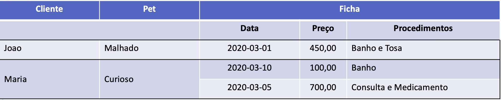

## 02 - Trabalho MongoDB

- Entregar o script correspondente aos passos executados

# Implementação

- Uma clínica veterinária deseja utilizar o MongoDB para armazenar o registro de atendimentos realizados para seus pacientes pet O dono da clínica registra atualmente os atendimentos em uma planilha Excel (descrita abaixo)

- Cada cliente possui uma ficha única onde cada atendimento é registrado

- Cada cliente possui apenas UM único PET

- Cada cliente / Pet pode ter mais de uma ficha com Data, Preço e Procedimentos

- Os atendimentos são incluídos na respectiva linha que identifica o cliente e pet gerando assim um histórico Implemente os requisitos abaixo:

- Criar a coleção e documentos para incluir a planilha de atendimentos

    - Incluir um novo registro na ficha do pet Malhado contendo os seguintes dados: data 2020-03-15, preço 800,00 e procedimentos Hospedagem
    - Incluir um novo procedimento "Consulta" para o cliente Maria no primeiro registro de sua ficha ficando a lista de procedimentos definida como ["Banho", "Consulta"]
    - Retornar o nome dos pets (sem o atributo _id) que tiveram procedimento "Hospedagem"
    - Retornar o nome dos pets (sem o atributo _id) onde tenha sido realizado apenas um único procedimento em alguma ficha. Por exemplo, apenas "Hospedagem" foi realizado para o "Malhado"
    - Retornar o nome do Cliente e Pet cujo preço do procedimento seja igual a 700. Dica: utilizar aggregate
    - Retornar o total do faturamento (soma dos preços dos procedimentos) por cliente . Dica: utilizar aggregate
    - Retornar o maior valor pago por atendimento por cliente. Dica: utilizar aggregate
    - Retornar o maior valor pago por atendimento pela "Maria". Dica: utilizar aggregate
    - Utilizando $where retornar todos os documentos onde o total de procedimentos realizados por cliente seja maior ou igual a 4

- Criar uma aplicação `nodejs` que exiba a lista de todos os atendimentos em uma única página